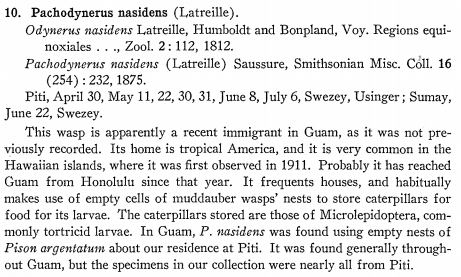

# Sources for Information on *Pachodynerus nasidens*

### Databases

[Symbiota Collections of Arthropods Network (SCAN)](https://scan-bugs.org/portal/collections/list.php?taxa=Pachodynerus%20nasidens&thes=1&type=1&db=all&page=1)

* 443 records for *Pachodynerus nasidens*
* 1 specimen in the UOG collection; [Collected by on Guam by Maehler in 1948](https://scan-bugs.org/portal/collections/listtabledisplay.php?db=180;&taxa=Pachodynerus). 
Lucky to find this record because the species epithet was misspelled (*nasdems*). This has been corrected.

[GBIF](https://www.gbif.org/occurrence/search?offset=120&q=Pachodynerus%20nasidens&taxon_key=1328213)

* 857 occurrence records
* many specimens at Bishop Museum, Honolulu

[Cook Islands Biodiversity Database](http://cookislands.bishopmuseum.org/results.asp?ebg=pachodynerus&Submit=Search&search=true)

* Recent introduction?? See Krauss 1960.
* Special Reference: Kuhlmann, M. (2006) Fauna and Biogeography of the Bees and Wasps of the Cook Islands (Hymenoptera Aculeata), J. Hym. Res. 15(1):26-37.

[Barcode of Life (BOLD) Database](http://barcodinglife.org/index.php/Taxbrowser_Taxonpage?taxon=Pachodynerus&searchTax=Search+Taxonomy)

* COI DNA barcode sequences available

### Other sources

[Swezey 1942. Wasps of Guam](http://hbs.bishopmuseum.org/pubs-online/pdf/b172p184-187.pdf)

[Bourquin 2002. Invertebrates Recorded from the Northern Mariana Islands, Status 2002.](https://apaseem.org/resources/files/Marianas_inverts_2002(2).doc)

* *Pachodynerus nasidens* not listed.

[Bourquin 2002. Invertebrate survey - Anatahan, Northern Mariana Islands](http://guaminsects.net/doc/misc/Bourquin2002%20Anatahan%20invert%20survey.doc)

* "*Pachodynerus nasidens* Latr.    Not previously collected from Anatahan, found commonly during this survey." Note that this entery is incorrectly listed under Megachilidae. Should be under Vespidae.

[Evenhuis et al. 2010. Terrestrial Arthropod Surveys on Pagan Island, Northern Marianas](http://pbs.bishopmuseum.org/pdf/pagan-report.pdf)

* *Pachodynerus nasidens* was collected and considered to be a new island record

#### Proceedings of the Hawaiian Ent. Soc.

[Sugerman 1972](https://scholarspace.manoa.hawaii.edu/handle/10125/11013)
 
* present in the Marshal Islands: Legan, Gellinam, Gugeegue, Gagan and Eniwetak Islets

[Fullaway 1946](https://scholarspace.manoa.hawaii.edu/bitstream/10125/16155/1/PHES13_051-053.pdf)

* present on Niihau

[Davis 1958](https://scholarspace.manoa.hawaii.edu/bitstream/10125/10796/1/17_62-66.pdf)

* *Pachodynerus nasidens* is a predator of *Syngamia haemorrhoidalis* a *Lantana* herbivore in Hawaii.

[Krauss 1960](https://scholarspace.manoa.hawaii.edu/bitstream/10125/10833/1/17_415-418.pdf)

* Present on Aitutaki Atoll, Cook Islands

[Beardsley and Tuthill 1959](https://scholarspace.manoa.hawaii.edu/bitstream/10125/10795/1/17_56-61.pdf)

* present on Niihau

[Krauss 1952](https://scholarspace.manoa.hawaii.edu/bitstream/10125/14830/1/15%281%29_217-220.pdf)

* present on Palmyra and Christmas Islands

[Suehiro 1960](https://scholarspace.manoa.hawaii.edu/bitstream/10125/10821/1/17_289-298.pdf)

* present on Midway Atoll

[Zimmerman and Fletcher 1955](https://scholarspace.manoa.hawaii.edu/bitstream/10125/14890/1/16%281%29_170-176.pdf)

* *Pachodynerus nasidens* preys on *Heliothis* in Hawaii

[Notes and Exhibitions, Hawaiian Ent.Soc. June 6, 1929](https://scholarspace.manoa.hawaii.edu/bitstream/10125/15792/1/PHES07_331-366_Notes_Exhib_1929.pdf)

* In *Notes on insects on Molokai* Williams reported "The immigrant, *Pachodynerus nasidens* is common."

[Krauss 1943](https://scholarspace.manoa.hawaii.edu/bitstream/10125/16091/1/PHES12_081-094.pdf)

* present on Molokai and Maui

